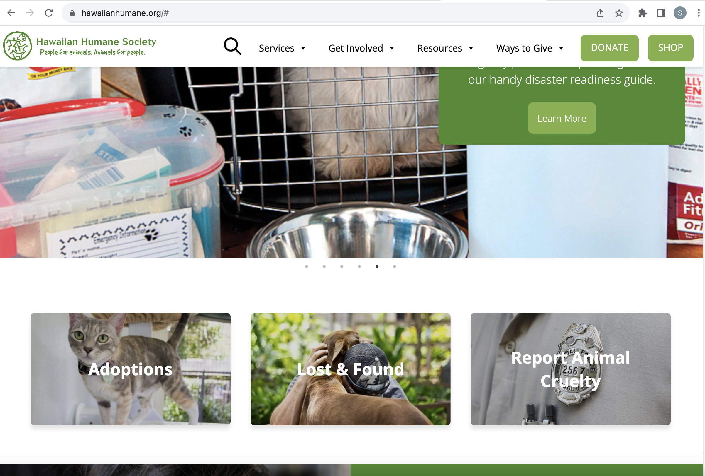
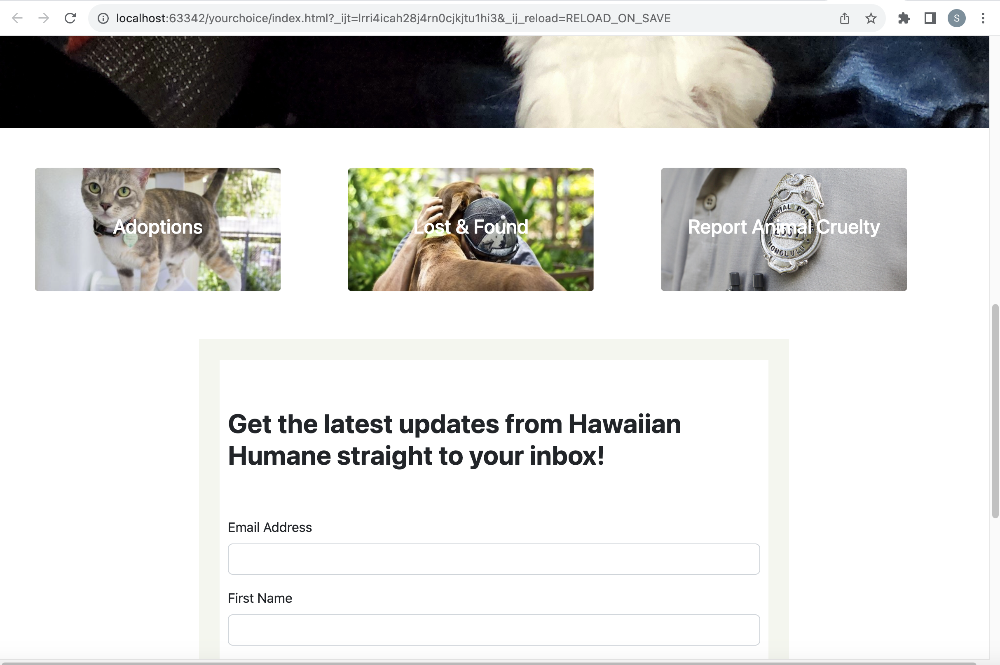

I have had previous experience with both HTML and CSS through FreeCodeCamp's Responsive Web Design cources. I never finished the curriculum offered, but I do believe I came out of it with a decent amount of knowledge about both. Still the reason I left the course unfinished primarily had to do with how I felt overwhelmed by the amount of different elements and different ways to style or modify them. I managed to create a basic survey form and a tribute page using HTML and CSS, but stopped once I was tasked with creating a documentation page. Considering my goal of working in software engineering, I knew I would have to return and finish the curriculum at some point.

This brings me to my current software engineering course, where I have been reintroduced to HTML and CSS. We spent one week learning the basics with my old friend FreeCodeCamp used as an additional resource. But primarily, I reviewed both by practicing them in a few assignments where I designed a simple webpage that displayed some background on various internet browsers. One particular new technique I learned involved neatly organizing different information into seperate columns. I also learned about importing Google fonts and linking pages by referencing other HTML files (the hard way I might add since it cost me an in-class assignment). But I believe the greatest strategy I learned was using a combination of \
 tags with class or id attributes to modify specific elements of a webpage.

## Gaining Confidence

My success at completing the assignment would strengthen my confidence in my ability to create using HTML and CSS. It is a personal goal of mine to create my own webpage similar to the professional portfolio I currently use to store these essays. But there are a few barriers I must overcome before moving on creating my page. For example, my understanding of the differences between padding, margins, borders, and how they can all be used to shape elements was only "okay" at best. One other particular barrier exists in my perceived lack of webpage design aesthetic. I have yet to really figure out for myself what makes a good design. I possess ideas: I think webpages should be minimal, easy to read, and easy to navigate. My usual strategy for designing things is to take inspiration from something that already exists that I personally like. Fortunately for me, there are many websites I find aestetically pleasing and easy to navigate through. All I need to do now is a figure a way to replicate the parts of the sites I do like.

## Simplifying a Complex Job

In class the instructor briefly showed how we could check the HTML and CSS of websites by accessing the browser's developer tools. This was huge. Much like I could try to understand how a machine works by disassembling it and putting it back together, I could try to recreate websites by checking its HTML and CSS... Or at least, that's what I would say if every major site had easy to read HTML for a person at my level. The reality is that there are a lot of different elements put in place with differing complexities of CSS to modify each element in many major websites. I sometimes wonder to myself how quickly people can create websites considering everything that exists in them.

## Are there any drawbacks to frameworks?

The last assignment I finished involved recreating the homepage of a website of my choice. For that assignment I chose to try and recreate the Hawaiian Humane Society home webpage which I've shared a screenshot of below:

I didn't immediately encounter any issues attempting to recreate it. A previous assignment served as a tutorial on how to create a navigation bar, complete with a logo, search icon, buttons, and dropdown menus. In fact, even if I had forgotten how to create a navigation bar, Bootstrap's official documentation page serves as an important resource to implmenting different types of elements in a webpage. What I did struggle with eventually was with styling techniques I had not used in previous assignments. For my website choice, specifically, I didn't know how to style buttons to overlay images onto them nor did I know how to add floating elements on top of backgrounds.

The above is my attempted recreation that I submitted.
