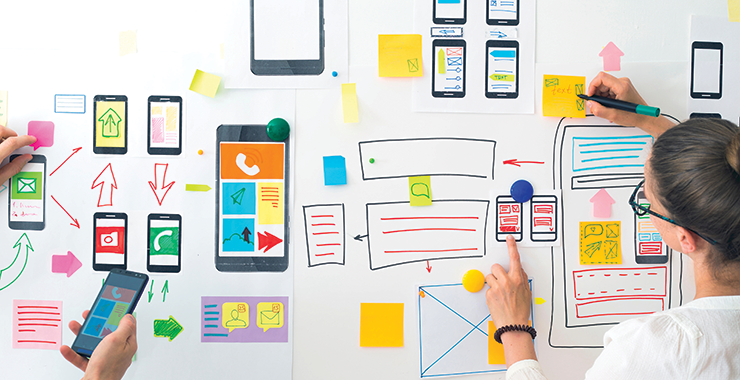

*Definitely not what I want to be... yet.*

I've spent a good chunk of my adolescent and teen years on a computer - Not developing applications or making games, but just interacting with people on online forums and very early forms of social networking platforms. I remember the first technical skills I acquired online - An amateur ability to create and edit on Photoshop, and the ability to manually edit my own forum post content using html and php. Skip ahead a few years, and now I'm on Myspace. Unlike Facebook, Myspace had a very messy default user interface - It was actually just plain ugly if I recall correctly. But unlike Facebook, Myspace allowed for customization, and there was plenty I could do. I would look to other profiles for inspiration and try learning about how I could create a profile page that was both very clean and catered to my stylistic preferences. And eventually I was successful, but by that point Facebook had become everyone's primary social media platform, and would abandon the page I worked so hard on.

Writing all this, I can see that I held a strong interest in design. I like to keep things simple. Whenever I get a new phone, I always install a new launcher that allows me to keep my homescreen clean of most apps save for the most important ones. I almost always keep my laptop's desktop entirely clean of any files and prefer to keep a minimalistic desktop background image. And even when I code, I like to make sure my code is as simple as possible - Not just because it makes it more readable for others, but because I generally like the look of minimal code whenever possible. I really want to design things, and programming is just an activity I found very fun to do.

## Inspirations and directions moving forward

I'm still in the process of learning programming. I understand that there are plenty of tools that I have yet to use, and I want to expose myself to as many as I can. Unfortunately, I'm not very self-sufficient and so I do rely on resources such as school and professionals to help me learn about programming. There are many things I'd like to personally build, one of which are simple games. I once joined a gaming club in high school, and we thought up the idea to develop a fighting game with club members being the playable characters and certain school faculty members being boss characters. It was sort of like classic Mortal Kombat, but without the extreme violence. We never made that game though, and it's something I think about when I reminisce. Currently I want to learn how to program a game to play chess, and another to play the card game gin rummy. Gin rummy is a simpler game, so I'd likely start on that when I have time.

I also like watching films and animations dealing with technology. Ghost in the Shell is a personal favorite anime of mine, and based on series' like it, I'd like to work with engineers and other designers in realizing technology involving artificial intelligence and virtual reality. Other interests involve technologies that assist with improving quality of life or improving accessibility. But reiterating what I stated at the start - *I am still in the process of learning*. Not just coding, but what my skills can potentially translate to in terms of technology.
