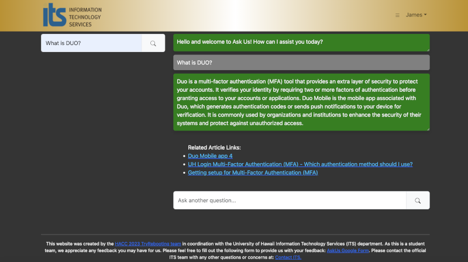

AskUs is a web application that incorporates a chatbot with a semantic search function to improve the search functionality on the [University of Hawaii's (UH) IT help article database](https://www.hawaii.edu/its/ask-us/). This application was initially created for the [Hawaii Annual Code Challenge (HACC)](https://hacc.hawaii.gov/), and then subsequently improved after the competition as a class final project submission. The application features the AI chatbot on the landing page, a link to a tutorial on how to use the application, and an additional page for admin users to analyze the frequency of IT articles used to answer user queries.

## My Role in the Project

I primarily functioned as the team leader and coordinator. This role proved somewhat difficult mostly due to conflicting teammate commitments and incompatible availability schedules. These issues would eventually lessen after the HACC finished, and the project officially became the group final project. In terms of my other work in the project, I was primarily responsible for the creation of the chatbot and its design. I also contributed to the database implementation, where I parsed all the provided HTML articles into a single CSV file containing the relevant metadata, as well as the implementation of Pinecone to store article embeddings into a specialized vector database. All additions and changes typically went through me before committing them to the main branch of the project. Finally I was responsible for deployment and continuous integration testing of the application.  

## What I learned

This project was my first experience in full stack development, but also proved to be a learning experience in team management. From the get-go I didn't know anything about creating a chatbot, but conveniently found [a MERN AI chatbot tutorial](https://www.youtube.com/watch?v=PX_YOfEdhRg) prior to the start of the HACC and used it as a basis for project planning and design layout. The tutorial covers a lot of important concepts in regards to authentication and security, but I personally was most interested in how to specifically tailor OpenAI to answer questions related to IT problems within UH. After deciding to use Meteor to develop the application, my first challenge came in migrating the code used in the tutorial to a Meteor environment. Two key concepts that arose here came in the handling of secret keys and HTTP requests. The handling of secret keys was never taught in class, and I learned about a variety of ways to use a secret key without exposing it to the public. The tutorial taught me how to handle HTTP requests using Node.js and Express, but this was ultimately unnecessary within the environment provided by Meteor. Instead I learned how to utilize Meteor methods to accomplish the same tasks of handling requests. This actually even proved enlightening since it led me to a greater understanding of the Meteor templates I've used for the class the whole semester.

In terms of team management, I learned more about what I *shouldn't* do the next time I lead a team. I go into more detail about it [here](https://jligeral.github.io/essays/building-the-golden-state-warriors.html), but in short I learned the importance of setting team expectations early and maintaining consistent good communication between team members.

### Team Members

Michelle Ho, James Ligeralde, Jonathan Sapolu, Frances Uy

### Links
- [Project Repository](https://github.com/tryRebooting2023/askus)
- [Project Organization](https://github.com/tryRebooting2023)
