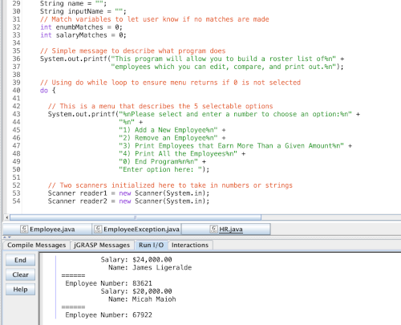

HR was the very first real assignment I completed for ICS 211. During our first week, we were tasked with defining an Employee object, which stored information on an employee's unique number, name, and salary, in Java then defining its exceptions - That served as a review of ICS 111 material. Using those, we were then tasked with writing a program which would add employees to an array and sort them via a self-repeating text menu.

This assignment set the tone for the rest of the course as it really tested my knowledge of arrays, iteration, accessing object properties, and validating input. ICS 111 assignments built off of previous assignments, but mainly tested our understanding of the last topic we learned. This assignment felt like what would have been a final project for ICS 111.

I started this assignment by first creating a self-repeating menu. My menu utilized switch case to choose specific options, and was kept on repeat by nesting it in a while loop that would end if the user entered "0" in the menu. Creating the menu was personally the easiest part of this assignment. I would then struggle to figure out a way to add employees into an array (without the use of ArrayList). I believe the process of figuring this out would take a few days, and it wasn't until I remembered one night that I could use a break statement to terminate a for loop that I successfully added an employee with no issues.

The rest of the program involved creating a "counter" variable which would increase if certain criteria were met during a for loop iteration. These were mostly important for printing out statements informing the user that no matches were found if they tried to search specific employee IDs or salary ranges.

Overall, I did complete the assignment on time and I was satisfied with my work at the time. Upon review of the code, I can definitely make a lot of improvements in its readability by utilizing static functions. I believe this assignment was worth preserving in its original state though as a marker for how far I've come.
