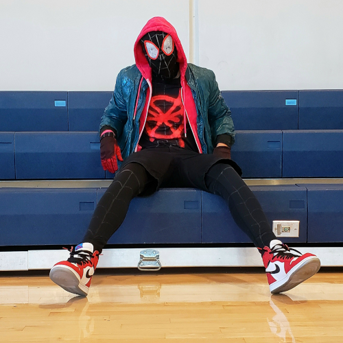

  
  

I'm a big fan of both Halloween and Spider-Man. So of course I wanted to dress up as Spider-Man one year, and I decided that for that year I would make the costume out of some basic clothes and other fabric materials. The particular Spider-Man I wanted to dress up as was Miles Morales' Spider-Man from *Into the Spider-Verse*.

For this DIY project, I searched up tutorials on how to create a Spider-Man mask, and found that I could buy a black latex mask on Amazon and spraypaint on the details like the eyes. cut out pieces of foam to make the exterior of the mask's eyes then spraypainted the interior white. To achieve the costume's web lines across the mask and the rest of the Spider-Man bodysuit, I used a silver permanent marker and drew them. The bodysuit was comprised of just a black dri-fit long-sleeved shirt and some leggings I purchased at Target. I also bought gloves from a Party City to complete the basic costume. Since I wanted to imitate the costume used in promotional material of the film (which included a sweater, jacket, shorts, and sneakers), I also purchased cheap, similar-looking clothes at H&M and modified them to my liking.

Overall I was very satisfied with my end product, and I continue to make costumes every year for Halloween.
