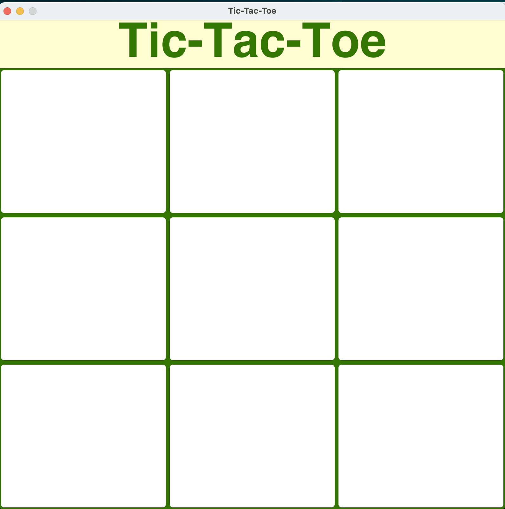

This is the first graphical user interface program I ever made. The player goes up against a random number generator, and wins by forming a horizontal, vertical, or diagonal row of three symbols (in this case "x's").

The biggest problem I encountered while working on this assignment involved the random number generator-run opponent. This puzzle involved figuring out how to make it move when it needed to. To accomplish this, I established a boolean variable which would alternate between true and false after each move. The random number generator would only perform when the boolean was false. Secondly I needed to figure out a way to make the random number generator choose only unused spaces on the tic-tac-toe board. To achieve this, I had the player mark spaces with a "X", and the random number generator mark spaces with a "O." I personally marked all the empty spaces with an asterisk "\*" and changed the font color to match the background color so it wouldn't appear. Using if and else statements, the program would check which character had "X," "O," or "*" in it before finalizing a move.

The last step to completing the assignment came in creating the win, lose, and draw conditions of the game. For this, I created functions for each condition. The draw condition was the most unique one which involved using a counter variable to determine if any moves are left available for the game. If none were available and neither the player nor the random number generator triggered a win or lose condition, then the game would end, and the word "Draw" would appear at the top. A separate endgame function was also made to ensure the random number generator or the player could not continue making moves after a winner was declared. 

I personally learned a lot completing this assignment, from discovering how boolean values can act as "switches," the complexity of enforcing rules in games, and the importance of functions in creating clean and readable code. I can even say that the assignment sparked an interest in trying to develop another simple game in the future.
